# Fork Up 🍤

A modern **Seafood Food Ordering E-commerce App** built with **Flutter** using **Clean Architecture** and **Riverpod** for scalable and maintainable state management.

Fork Up provides a smooth shopping experience for seafood lovers with categorized products, wholesale browsing, wishlist management, cart handling, search, filtering, and responsive UI design.

---

# 📱 Screenshots

## 🏠 Home Screen
<div style="display: flex; gap: 10px; flex-wrap: wrap;">
  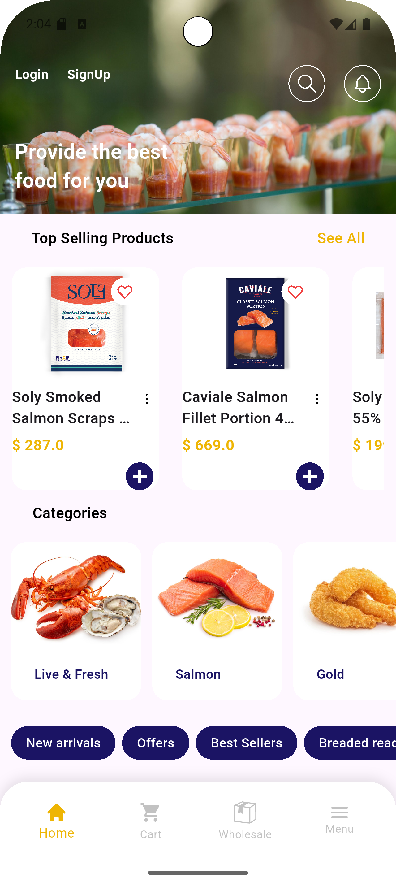
  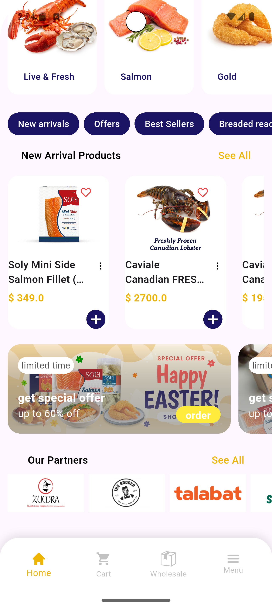
</div>

---

## 🛒 Cart
<div style="display: flex; gap: 10px; flex-wrap: wrap;">
  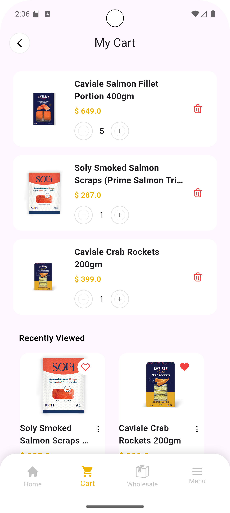
  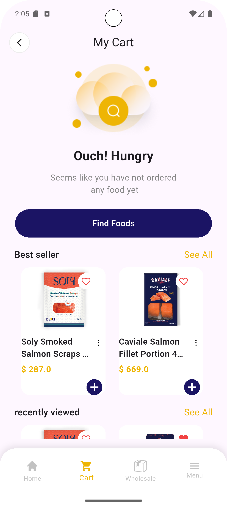
</div>

---

## ❤️ Wishlist
<div style="display: flex; gap: 10px; flex-wrap: wrap;">
  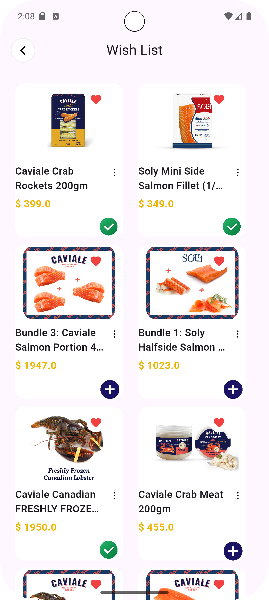
</div>

---

## 🔍 Search
<div style="display: flex; gap: 10px; flex-wrap: wrap;">
  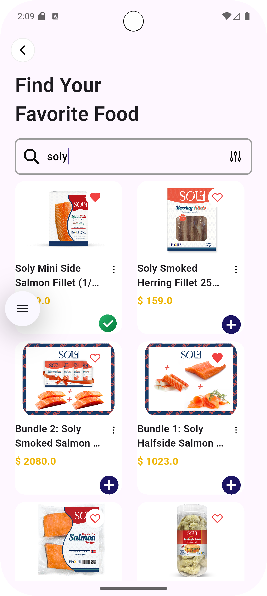
  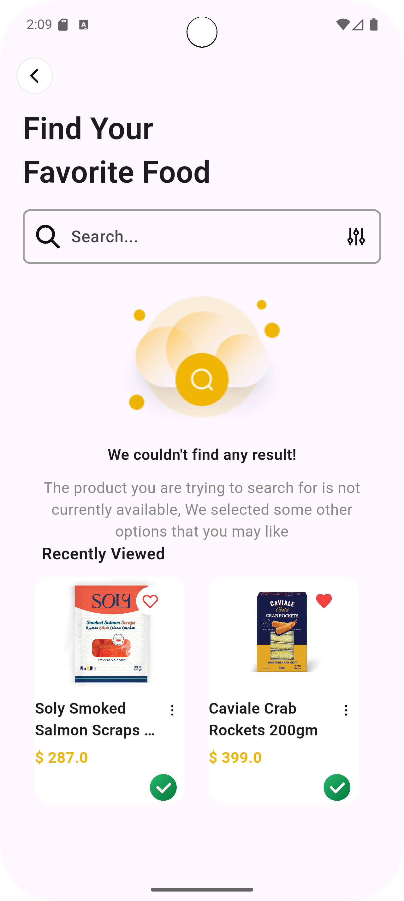
</div>

---

## 🧾 Categories & Sub Categories
<div style="display: flex; gap: 10px; flex-wrap: wrap;">
  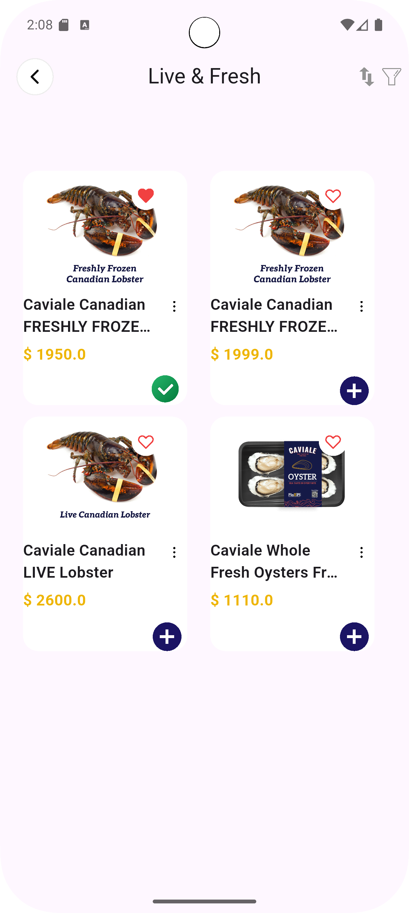
  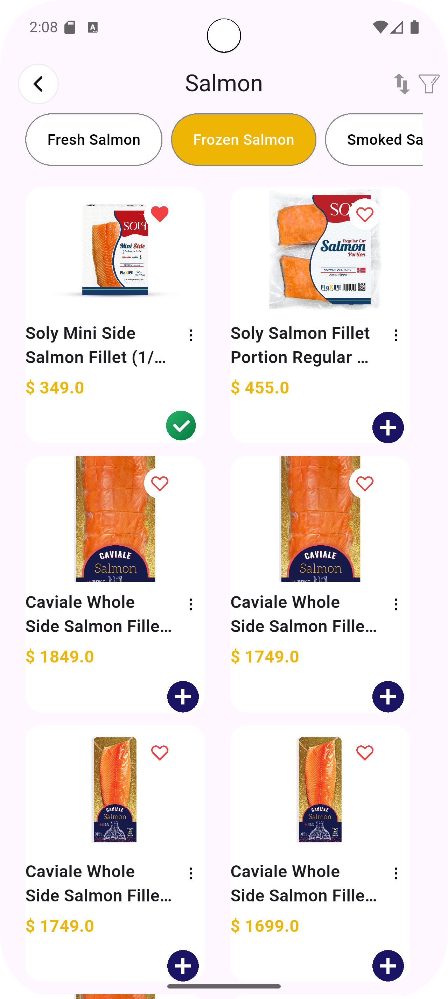
</div>

---

## 🥇 Top Selling & New Arrivals
<div style="display: flex; gap: 10px; flex-wrap: wrap;">
  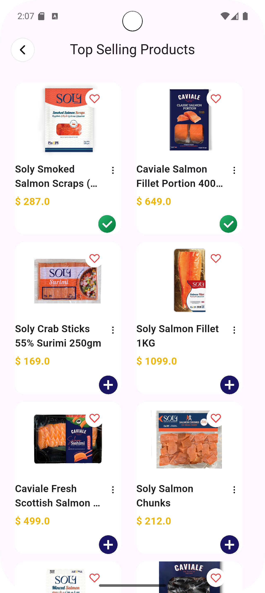
  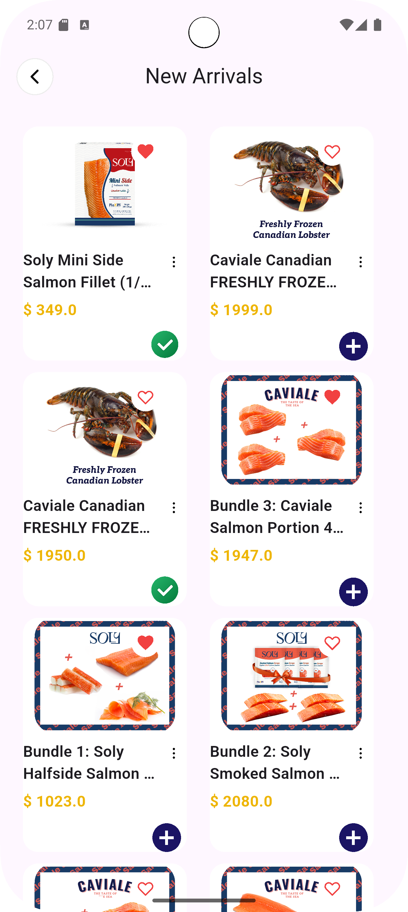
</div>

---

## 📦 WholeSale
<div style="display: flex; gap: 10px; flex-wrap: wrap;">
  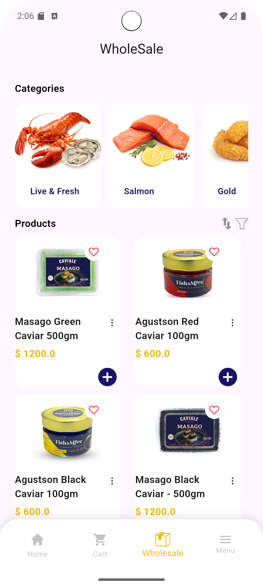
</div>

---

## 📋 Drawer Menu
<div style="display: flex; gap: 10px; flex-wrap: wrap;">
  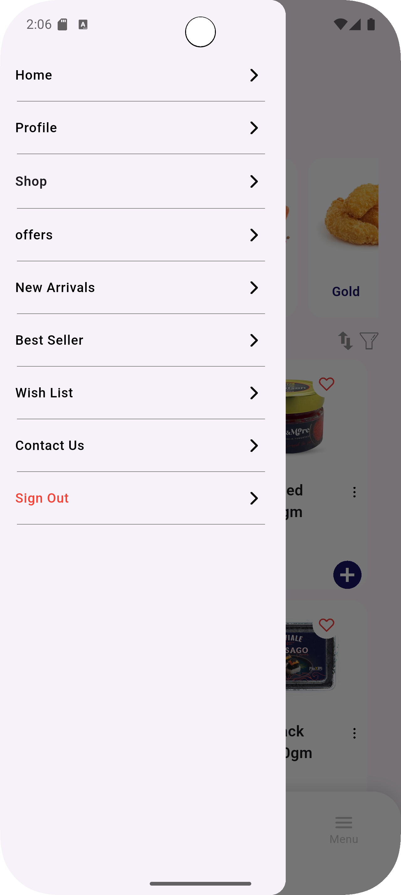
  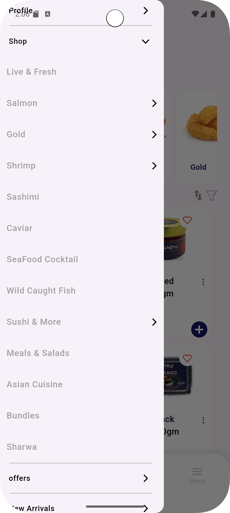
</div>

---

# ✨ Features

- 🏠 Modern Home Screen
- 🍤 Seafood Categories & Subcategories
- 📦 Wholesale Products
- 🔍 Product Search
- ❤️ Wishlist Management
- 🛒 Cart System
- 📄 Product Details
- 🔥 Top Selling Products
- 🆕 New Arrivals
- 🎯 Offers Section
- 📱 Responsive UI
- ♾️ Infinite Scroll Pagination
- 🌐 REST API Integration
- 🧩 Clean Architecture
- ⚡ Riverpod State Management

---

# 🏗️ Architecture

The project follows **Clean Architecture** principles.

```text
lib/
├── core/
├── data/
├── domain/
└── presentation/
```

## Layers

| Layer | Responsibility |
|---|---|
| Presentation | UI, Widgets, Providers, State Management |
| Domain | Entities, Repositories, Use Cases |
| Data | API Calls, Models, Repository Implementations |
| Core | Constants, Shared Widgets, Helpers, Services |

---

# 🛠️ Tech Stack

## State Management
- flutter_riverpod

## Networking
- dio
- REST API

## Local Storage
- shared_preferences

## UI
- flutter_svg
- cached_network_image

## Utilities
- equatable

---

# 📦 Dependencies

```yaml
flutter_riverpod: ^2.6.1
dio: ^5.9.2
flutter_svg: ^2.2.3
cached_network_image: ^3.4.1
shared_preferences: ^2.5.5
equatable: ^2.0.8
```

---

# 🚀 Getting Started

## Clone Repository

```bash
git clone https://github.com/abdalrhmanghanima/Fork_Up.git
```

## Install Packages

```bash
flutter pub get
```

## Run App

```bash
flutter run
```

---

# 🌐 API

The application uses REST APIs to fetch:

- Categories
- Subcategories
- Products
- Wholesale Products
- Offers
- Top Selling Products
- New Arrivals

---

# 📁 Assets Structure

```text
assets/
├── images/
├── icons/
└── readme/
```

---

# 🔮 Upcoming Features

- 🔐 Authentication
- 💳 Payment Integration
- 📍 Order Tracking
- 🌙 Dark Mode
- 🔔 Push Notifications
- 🌍 Localization
- 🧾 Order History

---

# 👨‍💻 Developer

### Abdelrahman Ghanima

GitHub:
https://github.com/abdalrhmanghanima/Fork_Up.git
